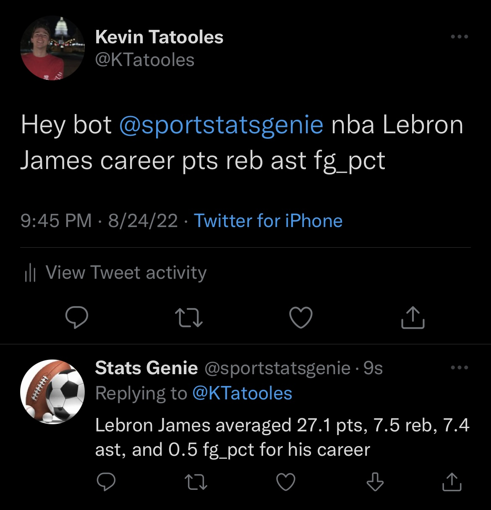
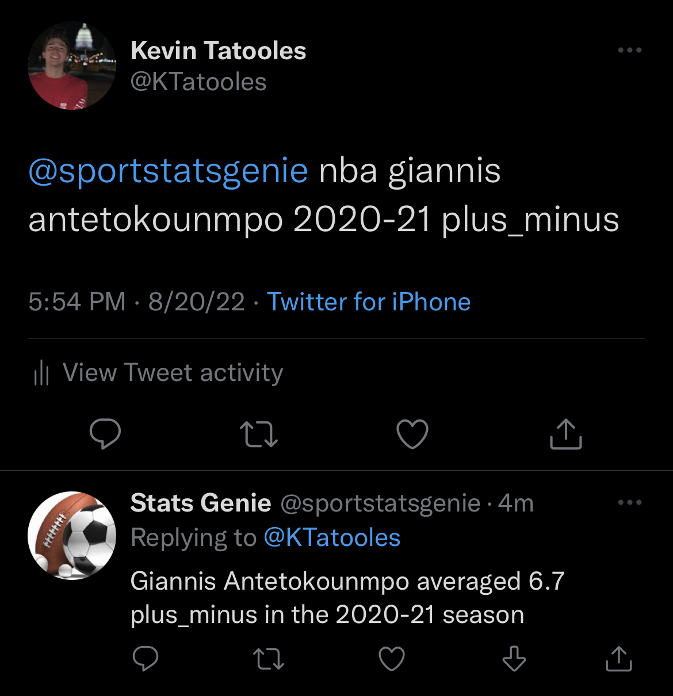
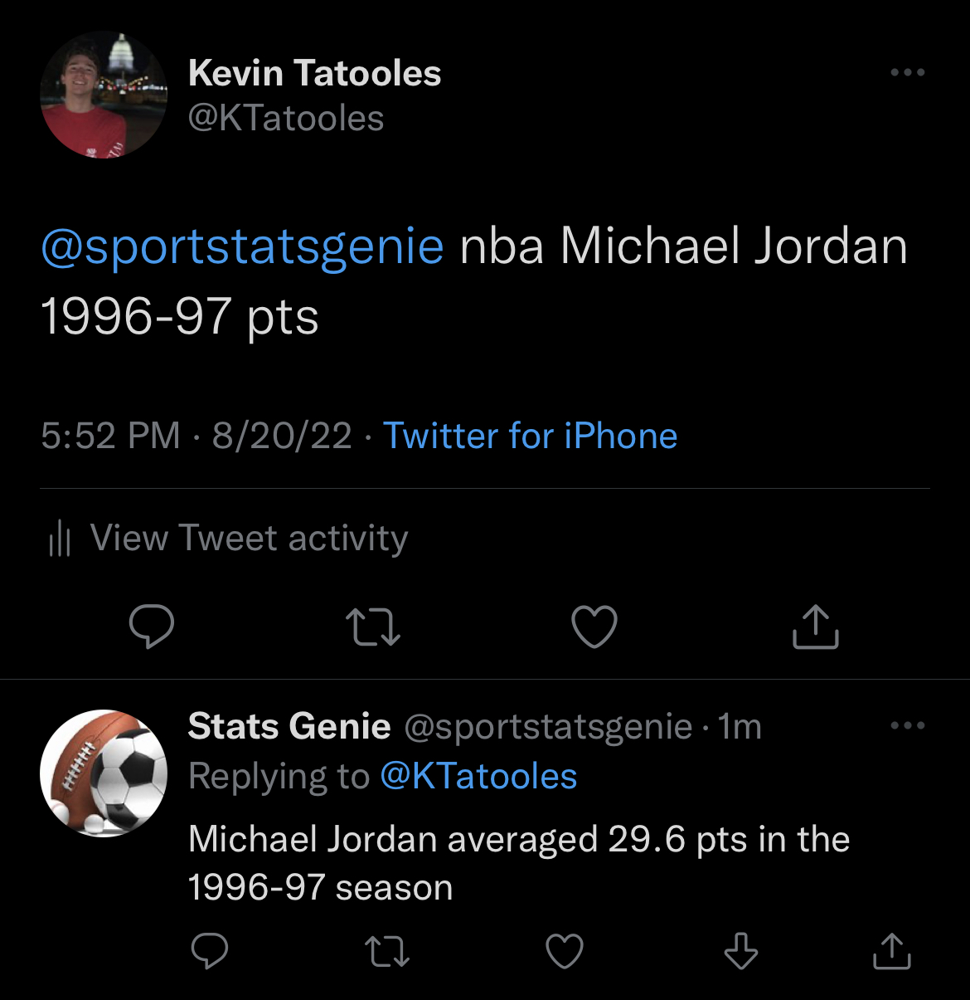

# Sports Stats Twitter Bot
Playing around with the Twitter API making a bot that responds to requests for sports stats

Bot is now live at https://twitter.com/sportstatsgenie and currently supports NBA stats from 1996 to present!

## How to Use
Here's how to use the bot! Tweet in the format:

"@sportstatsgenie LEAGUE PLAYER_FIRSTNAME PLAYER_LASTNAME SEASON STAT1 STAT2"

* Requests to the bot are NOT case sensitive so no need to worry about that!

* You can include as many stats as you want after the season, as long as the bot can fit them in it's 280 character response tweet.

* Currently the only supported league is "NBA" but more are coming soon!

* Supported seasons are 1996-97 through 2021-22, you can also replace the season with "career" to request the career stats of that player (since 1996).

Here are all of the supported stats (returned as per game):

nickname, team_abbreviation, age, gp, w, l, w_pct, min, fgm, fga, fg_pct, fg3m, fg3a, fg3_pct, ftm, fta, ft_pct, oreb, dreb, reb, ast, tov, stl, blk, blka, pf, pfd, pts, plus_minus, nba_fantasy_pts, dd2, td3, wnba_fantasy_pts, gp_rank, w_rank,l_rank, w_pct_rank, min_rank,fgm_rank, fga_rank, fg_pct_rank, fg3m_rank, fg3a_rank, fg3_pct_rank, ftm_rank, fta_rank, ft_pct_rank, oreb_rank, dreb_rank, reb_rank, ast_rank, tov_rank,  stl_rank, blk_rank, blka_rank, pf_rank, pfd_rank, pts_rank, plus_minus_rank, nba_fantasy_pts_rank, dd2_rank, td3_rank, wnba_fantasy_pts_rank

Here are the stats you might actually want to use:

team_abbreviation, age, gp, w_pct, min, fg_pct, fg3_pct, ft_pct reb, ast, tov, stl, blk, blka, pf, pts, plus_minus, nba_fantasy_pts

## Examples
 Lebron James averaged 27.1 pts, 7.5 reb, 7.4 ast, and 0.5 fg_pct for his career" width="300" />

 Giannis Antetokounmpo averaged 6.7 plus_minus for the 2020-21 season" width="300" />

 Michael Jordan averaged 29.6 pts in the 1996-97 season" width="300" />

## Future Features
Default values for if the user excludes season or stats

Ability to compare the stats of two players

Support for MLB and NFL stats